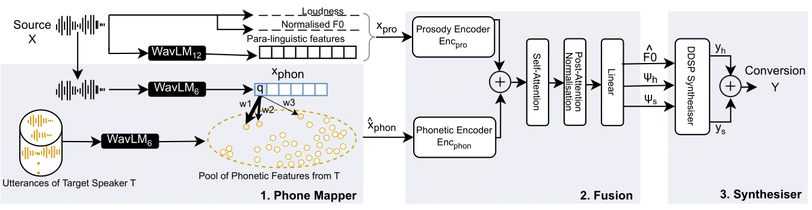

# DDSP-QbE

This repository contains the source code for the paper *[Anonymising Elderly and Pathological Speech: Voice Conversion Using DDSP and Query-by-Example](https://www.researchgate.net/publication/381469769_Anonymising_Elderly_and_Pathological_Speech_Voice_Conversion_Using_DDSP_and_Query-by-Example)*, accepted at Interspeech 2024.



## Highlights

- **DDSP-QbE:** An end-to-end any-to-any voice conversion (VC) method designed to preserve prosody and domain characteristics in speech anonymization, even for unseen speakers from non-standard data, including pathological (stuttering) and elderly populations.
- **Core Concepts:**
  - Query-by-Example (QbE)
  - Differentiable Digital Signal Processing (DDSP)
- **Proposed Approach:**
  - Utilizes a subtractive harmonic oscillator-based DDSP synthesizer, inspired by the human speech production model, for effective learning with limited data.
  - Introduces an inductive bias for prosody preservation by:
    - Employing a novel loss function that uses emotional speech to separate prosodic and linguistic features.
    - Adding supplementary hand-crafted and deep learning-generated input features with prosodic knowledge from the source utterance.
- **Generalizability:** Demonstrated on the following benchmark datasets across different genders, emotions, ages, pathologies, and cross-corpus conversions:
  - [Emotional Speech Dataset (ESD)](https://hltsingapore.github.io/ESD/)
  - [Sep28-K](https://machinelearning.apple.com/research/stuttering-event-detection)
  - [Dementia (ADReSS Challenge)](https://luzs.gitlab.io/adress/)

## Samples

Some samples can be found [here](https://github.com/suhitaghosh10/ddsp-qbe/tree/main/samples). Due to privacy concerns, not all samples are available.

## Demo

[Here...](https://github.com/suhitaghosh10/ddsp-qbe/blob/main/ddsp-qbe.ipynb)

## Pre-requisites

1. Python >= 3.11
2. Install the Python dependencies mentioned in `requirements.txt`:

    ```
    pip install -r requirements.txt
    ```

## Training (Documentation WIP)

### Before Training

1. Download the Librispeech and ESD datasets.
2. Generate the WavLM 6th and 12th layers embeddings using `preprocess.py`.
3. Configure all the training hyperparameters and paths in `resources/config.yaml`.
4. Specify the WavLM paths in `config.yaml` (`train_path` and `val_path`).
5. If using the emotion leakage-specific loss, ensure all WavLM 6th layer embeddings for ESD files are available at the location specified in `config.yaml` under `emotion_files_wavlm6_path`. Set `use_emo_loss` to `True` in the config file.

### Train

To start training, use the following command:

    ```
    python train.py -g <gpu number> --config ./resources/config.yaml
    ```

### Model Weights

The model weights are located in `resources/model_weights`.

## References and Acknowledgements

* In the original paper, the model was trained with ESD and data from Sep28-K and the ADReSS Challenge. However, due to privacy issues, we have provided an example training script using publicly available datasets. The pathological datasets can be obtained upon request from their corresponding websites.
